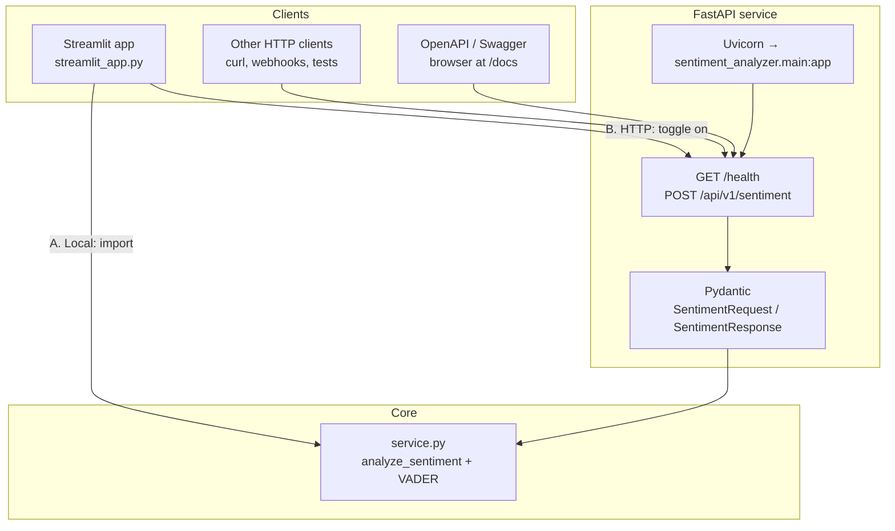
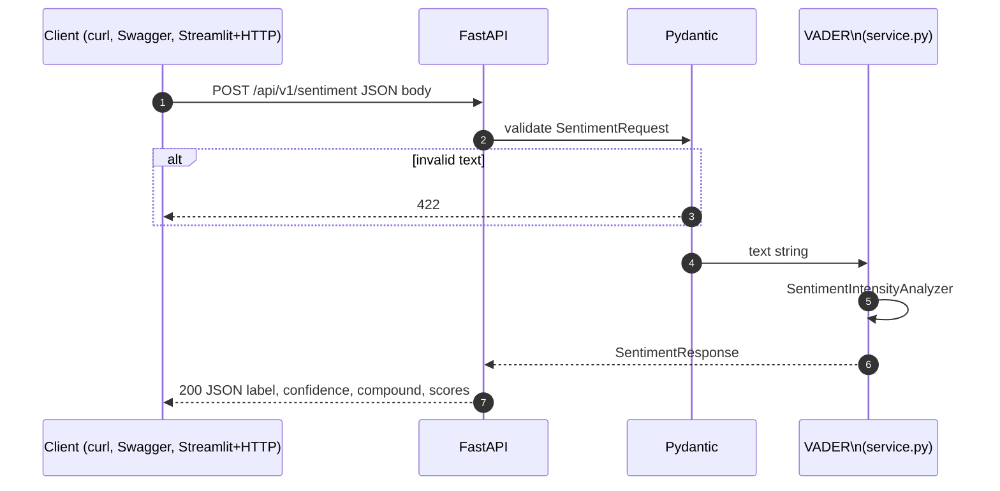
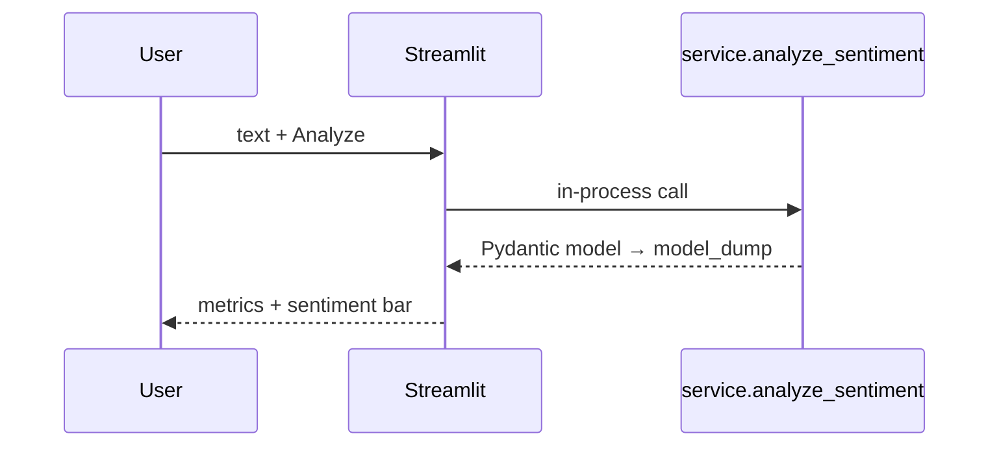

# Workflow & architecture

How requests move through the **Day 1 Sentiment Analyzer** project: FastAPI, shared scoring, and the Streamlit app (two modes).

## High-level data flow



- **Path A (default in Streamlit):** UI calls `analyze_sentiment()` in process — no HTTP, same logic as the API.  
- **Path B (sidebar “Call HTTP API”):** UI sends `POST` to the running Uvicorn server.  
- **Path C:** Any client uses the public JSON contract; core logic is always `service.py`.

## Request sequence (API path)



**Startup:** `lifespan` calls `warm_vader()` so the lexicon is loaded before the first request.

## Request sequence (Streamlit, local engine)



## Component view

```mermaid
flowchart LR
    subgraph config
        ENV[.env / SENTIMENT_*]
    end
    ENV --> CFG[config.py / Settings]
    CFG --> main[main.py]

    main --> COR[CORS]
    main --> R1[/api/v1/sentiment]
    main --> R0[/health]

    R1 --> SCH[schemas.py]
    SCH --> SVC[service.py]
    SVC --> VAD[VADER lexicon]
```

## File map (short)

| Piece | Role |
|-------|------|
| `streamlit_app.py` | UI; local scoring **or** `httpx` → API |
| `main.py` | Routes, CORS, OpenAPI, lifespan |
| `service.py` | VADER, `SentimentResponse` |
| `schemas.py` | Request/response contracts |
| `config.py` | `SENTIMENT_*` env |

GitHub and many Markdown viewers render the Mermaid blocks above. For a PNG/SVG export, use [Mermaid Live Editor](https://mermaid.live) or a docs build that supports Mermaid.
